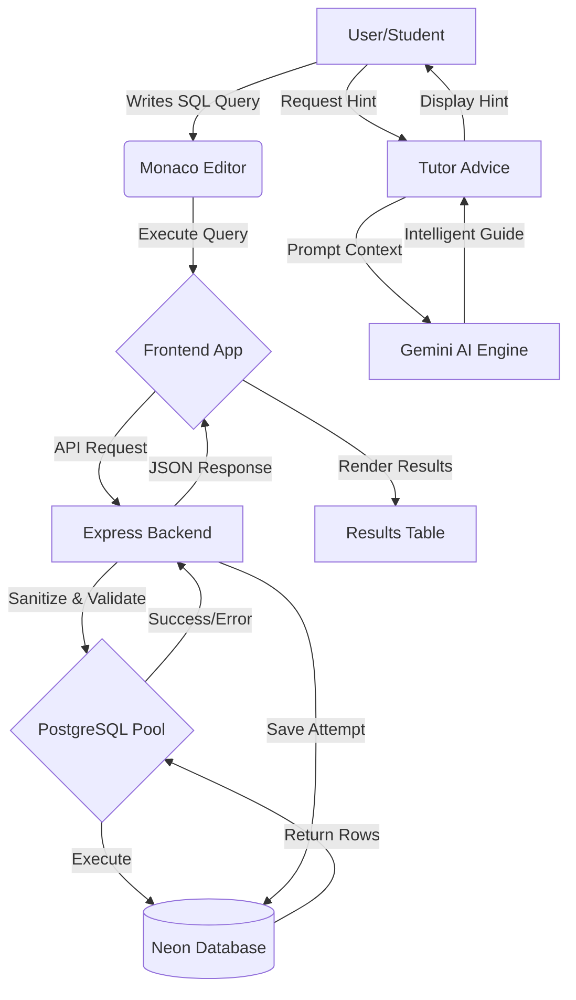

# CiphersSQLStudio 🚀

A browser-based SQL learning platform where students can practice SQL queries against pre-configured assignments with real-time execution and intelligent AI-powered hints.

## 🌟 Key Features

- **Interactive SQL Editor**: Industry-standard code editing experience powered by **Monaco Editor**.
- **Real-time Execution**: Instant feedback with formatted results directly from a PostgreSQL sandbox.
- **Intelligent Hints**: AI-driven tutor guidance (via Gemini API) that provides conceptual hints without giving away solutions.
- **Progress Tracking**: Automatic persistence of user query attempts to track learning progress.
- **Personalized Experience**: Full authentication system with dedicated user dashboards.

## 📊 Data-Flow Diagram



## 🛠️ Tech Stack

### Frontend
- **React.js**: Core UI library.
- **SCSS**: Modular, mobile-first styling following BEM conventions.
- **Monaco Editor**: Professional-grade SQL editing.
- **Vite**: Ultra-fast build tool and dev server.

### Backend
- **Node.js / Express**: Robust server-side logic and RESTful API.
- **PostgreSQL**: Reliable relational database (Neon).
- **Gemini AI**: intelligent tutoring through LLM integration.

## 🚀 Getting Started

### Prerequisites
- Node.js (v18+)
- PostgreSQL Database (Neon.tech recommended)

### Installation

1. **Clone the repository**:
   ```bash
   git clone https://github.com/kuldeep456789/Sql.git
   cd Sql
   ```

2. **Backend Setup**:
   ```bash
   cd backend
   npm install
   # Create a .env file with:
   # PORT=3000
   # DATABASE_URL=your_postgres_url
   # GEMINI_API_KEY=your_gemini_key
   node seed.js  # Initialize database and sample data
   npm start
   ```

3. **Frontend Setup**:
   ```bash
   cd ../frontend
   npm install
   npm run dev
   ```

## 🎨 UI/UX Rationale
The application follows a "Modern Dark" aesthetic to reduce eye strain during long coding sessions. The workspace is split into a instructions sidebar and a resizable editor/results area, maximizing focus on the core task: writing and testing SQL queries.

---
Built with ❤️ for SQL Students.
